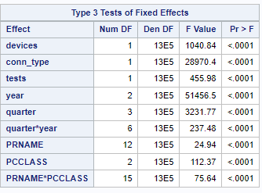
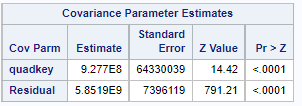
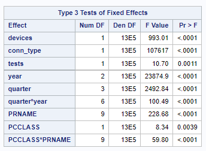
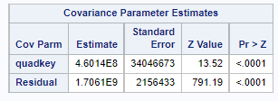

# Introduction

(Quoted from the SCC website)

The Government of Canada has committed to helping 95% of Canadian households and businesses access high-speed internet at minimum speeds of 50 Mbps download and 10 Mbps upload (hereinafter referred to as the “Commitment”) by 2026, and 100% by 2030. According to the CRTC, currently 45.6% of rural community households have access to the Commitment based on what’s available to them via an Internet Service Provider (e.g. Shaw, Telus, etc.) in their region, rather than what a rural household actually realizes at home in terms of internet speeds. 

For this case study, the SCC would like to understand the state of internet connectivity in both rural and underserved Canadian communities using consumer-provided data. The SCC claims that by using data directly from the consumer, it is possible to better understand connectivity in these communities as measured by the consumers in their own homes. 

Specifically, the following is desired:

1. A statistical analysis of the current realized and forecasted internet speeds (upload and download) for rural and undeserved communities in terms of progress towards the Commitment;

2. A comparative analysis of rural and underserved communities in terms of progress towards the Commitment; and

3. The identification of statistically reliable methods to assess and compare rural and underserved communities's realized internet access.For this study in particular, the identification of reliable and reproducible statistical methods to understand connectivity of rural and underserved Canadian communities is critical. 

The following analysis aims to address the above in a practical and concise manner. 

# The Data

The data was made available by the [Statiscal Society of Canada](https://ssc.ca/en/case-study/towards-a-clear-understanding-rural-internet-what-statistical-measures-can-be-used-assess) with [Ookla](https://www.ookla.com) and [Statistics Canada](https://www.statcan.gc.ca/en/start). One of the first things to check regarding the data is to see if any missing data is present in the dataset. Figure 1 shows that most of the missing data is related to population center information. Namely data on population center id, type and class (PCUID, PCTYPE, PCLASS). 

```{r message=FALSE, warning=FALSE, include=FALSE}
library(tidyverse)
library(ggthemes)
library(ggspatial)
library(plotly)
library(rnaturalearth)
library(sf)
library(scales)
library(reshape2)
#dt<- readr::read_csv("./ConsultingData/ookla-canada-speed-tiles.csv")
# Accomidating for mtor
setwd("/home/ben2908")
dt<- readr::read_csv("./ookla-canada-speed-tiles.csv")
```

```{r echo=FALSE, fig.cap="Missing data present in dataset provied", message=FALSE, warning=FALSE}
naniar::vis_miss(dt ,warn_large_data = FALSE)+
  theme(axis.text.x=element_text(angle=90))
```

While it is possible to apply some treatment to the missing data, after removal, the remaining sample is  1,252,560 rows, which is still usable for this analysis. As such a filtered data set is used. 

# Analysis


## Current Realized And Forecasted Internet Speeds (Upload And Download)- A Statistical Analysis

It is possible to describe the relationship between the current realized and forecasted internet speeds by use of a statistical model. For this analysis a mixed model structure is chosen with random effects being province, population class and their interaction. For choice of fixed effects in the model the use of directed acyclic graphs (DAGs) is employed for parameter selection. Figure 2 is the DAG which was used for this model development. 

<!---
Need to add figure captions
--->
```{r echo=FALSE, message=FALSE, warning=FALSE, fig.cap="DAG representing the relationship between the fixed effects and upload/download time."}
library(ggdag)

dagify(download_time~latency,
       download_time ~ conn_type,
       download_time ~tests,
       download_time~year,
       download_time~quarter,
       quarter~year,
       latency~ conn_type,
       latency~no_of_devices,
       year~quarter,
       download_time~pcclass,
       download_time~prname,
       pcclass~prname,
       labels=c("download_time"="Download/Upload Speed",
                "latency" = "Latency",
                "conn_type"="Connection Type\n(Fixed,Mobile)",
                "no_of_devices"="No. of Devices",
                "tests"="No. of tests",
                "year"="Year\n(2019,2020,2021)",
                "quarter"="Quarter\n(Q1,Q2,Q3,Q4)",
                "prname"="Province",
                "pcclass"="Pop. Center\nClass")) %>% 
  tidy_dagitty() %>% 
  # prname (8,2) pcclass(8.5,1.5)
  mutate(xend=c(10.5,9,10.5,9,10.5,10.5,8.5,10.5,9.5,10.5,10.5,10,NA),
         yend=c(0,0,0,0,0,0,-2,0,-1.7,0,0,-2,NA),
         x=ifelse(name=="download_time",10.5,
                  ifelse(name=="latency",9,
                         ifelse(name=="conn_type",9.5,
                                       ifelse(name=="tests",10,
                                              ifelse(name=="year",9.5,
                                                     ifelse(name=="quarter",10,
                                                        ifelse(name=="no_of_devices",8,
                                                               ifelse(name=="prname",8,
                                                                      8.5)))))))),
         y=ifelse(name=="download_time",0,
                  ifelse(name=="latency",0,
                         ifelse(name=="conn_type",1,
                                       ifelse(name=="tests",1,
                                              ifelse(name=="year",-1.7,
                                                     ifelse(name=="quarter",-2,
                                                             ifelse(name=="no_of_devices",0,
                                                               ifelse(name=="prname",-1.5,
                                                                      -2)))))))),
         effectType=ifelse(name %in% c("download_time",
                "latency",
                "conn_type",
                "no_of_devices",
                "tests",
                "year",
                "quarter"),"Fixed","Random")) %>% 
  ggdag(text=FALSE,use_labels = "label")+
  ggtitle("Relationship between Fixed Effects and Download/Upload Time")+
  theme_dag()
```

The fixed and random effects are listed in table 1 below:  

```{r echo=FALSE, message=FALSE, warning=FALSE}
tibble(`Fixed Effects` = c("No. of devices",
                           "Connection Type",
                           "No. of Tests",
                           "Year",
                           "Quarter",
                           "Province",
                           "Population Center Class",
                           "Year*Quarter",
                           "Province*Population Center Class"),
       `Random Effect` = c("quadkey", rep("",8))) %>% knitr::kable(caption = "Fixed and Random Effects used to describe Upload/Download Speed")
```


The model can be represented in the following form:

$$Y = X\beta + Zb$$ 

Where $Y$ is the response variable (i.e. download/upload speed) $X$ is the design matrix for the fixed effects, $Z$ is the design matrix of the random effects and $\beta$ and $b$ are the  fixed and random effects vectors. Two separate models are constructed for download and upload speed. Figures 3 and 5 show that the fixed effects are all significant at the 0.001 level with the exception to the upload speed model which lists the p-values of the effects of the number of tests conducted and the population center class as 0.0011 and 0.0039 respectively. Figures 4 and 6 show that the random effects of the individual tile measured is significant at the 0.001 level. 


```{r echo=FALSE, fig.align='center', fig.cap="Type 3 tests of fixed effects for download speed model", out.width="45%"}

```


```{r echo=FALSE, fig.align='center', fig.cap="Covariance parameter estimates of the random effects in the download speed model", out.width="45%"}

```


```{r echo=FALSE, fig.align='center', fig.cap="Type 3 tests of fixed effects for upload speed model", out.width="45%"}

```


```{r echo=FALSE, fig.align='center', fig.cap="Covariance parameter estimates of the random effects in the download speed model", out.width="45%"}

```
\newpage


## Rural and Underserved communities in terms of progress towards the Commitment

Figures 7 and 8 show that on average, most provinces are keeping to the Commitment above and beyond the requirements provided for all communities. The provinces which appear to be experiencing challenges with this are the Northwest Territories, Nunavut and Yukon- all of whom have available data on small population centers^[According to Wikipedia there are only small population centers in the Canadian Territories as of 2016. Reference: https://en.wikipedia.org/wiki/List_of_population_centres_in_the_Canadian_Territories]. While this does offer a "birds eye view" a more accurate portrayal is to look at the proportion of tiles in population centers which are meeting the agreement  and which are not. Figures 4-9 outline such characteristics. In terms of small population centers, all provinces appear to be making progress in the Comittment with the exception to Nunavut which appears to be struggling. For medium population centers, Manitoba appears to struggle with making any progress for upload time, but has improved in terms of download time.

```{r echo=FALSE, message=FALSE, warning=FALSE, fig.cap="Average download speed accross provinces over time, by population center size"}
# Need to filter based on PCCLASS
dt %>% 
  filter(!is.na(PCCLASS)) %>% 
  group_by(PCCLASS,PRNAME,year,quarter) %>% 
  summarize(average_d_time = mean(avg_d_kbps/1000)) %>% 
  mutate(year_quarter=paste(year,quarter),
         Province= ifelse(grepl("\\/",PRNAME),PRNAME %>% str_extract('.*(?= \\/)'),PRNAME),
         popcenter_class = ifelse(PCCLASS==2, "Small (1000-29,999)",ifelse(PCCLASS==3, "Medium (30,000-99,999)",ifelse(PCCLASS==4,"Large (>100,000)","OTHER")))) %>% 
  ggplot(mapping=aes(x= year_quarter,y=average_d_time,color= popcenter_class,group= popcenter_class))+
  geom_point()+
  geom_line()+
  facet_wrap(~Province)+
  ggtitle("Average Download Speed 2019-2021")+
  labs(y="Average Download Speed (mbps)")+
  scale_color_discrete(guide = guide_legend(reverse=TRUE))+
  theme(axis.ticks.x = element_blank(),
        axis.text.x = element_blank(),
        axis.title.x = element_blank(),
        legend.title=element_blank(),
        legend.position = "bottom")

```


```{r echo=FALSE, message=FALSE, warning=FALSE,  fig.cap="Average upload speed accross provinces over time, by population center size"}
# Need to filter based on PCCLASS
dt %>% 
  filter(!is.na(PCCLASS)) %>% 
  group_by(PCCLASS,PRNAME,year,quarter) %>% 
  summarize(average_u_time = mean(avg_u_kbps/1000)) %>% 
  mutate(year_quarter=paste(year,quarter),
         Province= ifelse(grepl("\\/",PRNAME),PRNAME %>% str_extract('.*(?= \\/)'),PRNAME),
         popcenter_class = ifelse(PCCLASS==2, "Small (1000-29,999)",ifelse(PCCLASS==3, "Medium (30,000-99,999)",ifelse(PCCLASS==4,"Large (>100,000)","OTHER")))) %>% 
  ggplot(mapping=aes(x= year_quarter,y=average_u_time,color= popcenter_class,group= popcenter_class))+
  geom_point()+
  geom_line()+
  facet_wrap(~Province)+
  ggtitle("Average Upload Speed 2019-2021")+
  labs(y="Average Upload Speed (mbps)")+
  scale_color_discrete(guide = guide_legend(reverse=TRUE))+
  theme(axis.ticks.x = element_blank(),
        axis.text.x = element_blank(),
        axis.title = element_blank(),
        legend.title=element_blank(),
        legend.position = "bottom")

```

```{r echo=FALSE, message=FALSE, warning=FALSE, fig.cap="Proportion of small population centers accross canada meeting the commitment download speed over time"}
# Small Provinces

smallProvs_Download<- dt %>%
              mutate(year_quarter=paste(year,quarter),
                     Province= ifelse(grepl("\\/",PRNAME),PRNAME %>% str_extract('.*(?= \\/)'),PRNAME),
                      popcenter_class = ifelse(PCCLASS==2, 
                                               "Small (1000-29,999)",
                                               ifelse(PCCLASS==3, 
                                                      "Medium (30,000-99,999)",
                                                      ifelse(PCCLASS==4,"Large (>100,000)",
                                                             "OTHER"))),
                      d_status=ifelse((avg_d_kbps/1000)<50,"Below Commitment","Meeting Commitment"),
                      u_status=ifelse((avg_u_kbps/1000)<10,"Below Commitment","Meeting Commitment")) %>% 
                filter(!is.na(PCCLASS),popcenter_class=="Small (1000-29,999)") %>% 
                group_by(Province, year_quarter) %>% 
                count(d_status) 


smallProvs_Download<- do.call(rbind,
                     by(smallProvs_Download,smallProvs_Download["Province"],tibble) %>% 
                     lapply(function(x) do.call(rbind,by(x,x["year_quarter"],tibble) %>% 
                                                  lapply(function(y) y %>% mutate(prop = y$n/sum(y$n)))))
)

smallProvs_Download %>% 
  ggplot(mapping=aes(x=year_quarter,y=prop,color=d_status, group = d_status))+
  #geom_bar(stat="identity")+
  geom_line()+
  geom_point()+
  facet_wrap(~Province)+
  ggtitle("Proportion of Small Population Centers Meeting the Commitment\n(Download Speed)")+
  labs(y="Average Download Speed (mbps)")+
  scale_color_discrete(guide = guide_legend(reverse=TRUE))+
  theme(axis.ticks.x = element_blank(),
        axis.text.x = element_blank(),
        axis.title = element_blank(),
        legend.title=element_blank(),
        legend.position = "bottom")
             
```

```{r echo=FALSE, message=FALSE, warning=FALSE, fig.cap= "Proportion of small population centers accross canada meeting the commitment upload speed over time"}

smallProvs_Upload<- dt %>%
              mutate(year_quarter=paste(year,quarter),
                     Province= ifelse(grepl("\\/",PRNAME),PRNAME %>% str_extract('.*(?= \\/)'),PRNAME),
                      popcenter_class = ifelse(PCCLASS==2, 
                                               "Small (1000-29,999)",
                                               ifelse(PCCLASS==3, 
                                                      "Medium (30,000-99,999)",
                                                      ifelse(PCCLASS==4,"Large (>100,000)",
                                                             "OTHER"))),
                      d_status=ifelse((avg_d_kbps/1000)<50,"Below Commitment","Meeting Commitment"),
                      u_status=ifelse((avg_u_kbps/1000)<10,"Below Commitment","Meeting Commitment")) %>% 
                filter(!is.na(PCCLASS),popcenter_class=="Small (1000-29,999)") %>% 
                group_by(Province, year_quarter) %>% 
                count(u_status) 


smallProvs_Upload<- do.call(rbind,
                     by(smallProvs_Upload,smallProvs_Upload["Province"],tibble) %>% 
                     lapply(function(x) do.call(rbind,by(x,x["year_quarter"],tibble) %>% 
                                                  lapply(function(y) y %>% mutate(prop = y$n/sum(y$n)))))
)

smallProvs_Upload %>% 
  ggplot(mapping=aes(x=year_quarter,y=prop,color=u_status, group = u_status))+
  #geom_bar(stat="identity")+
  geom_line()+
  geom_point()+
  facet_wrap(~Province)+
  ggtitle("Proportion of Small Population Centers Meeting the Commitment\n(Upload Speed)")+
  labs(y="Average Upload Speed (mbps)")+
  scale_color_discrete(guide = guide_legend(reverse=TRUE))+
  theme(axis.ticks.x = element_blank(),
        axis.text.x = element_blank(),
        axis.title = element_blank(),
        legend.title=element_blank(),
        legend.position = "bottom")
```

```{r echo=FALSE, message=FALSE, warning=FALSE, fig.cap= "Proportion of medium population centers accross canada meeting the commitment download speed over time"}
# Medium 
medProvs_Download<- dt %>%
              mutate(year_quarter=paste(year,quarter),
                     Province= ifelse(grepl("\\/",PRNAME),PRNAME %>% str_extract('.*(?= \\/)'),PRNAME),
                      popcenter_class = ifelse(PCCLASS==2, 
                                               "Small (1000-29,999)",
                                               ifelse(PCCLASS==3, 
                                                      "Medium (30,000-99,999)",
                                                      ifelse(PCCLASS==4,"Large (>100,000)",
                                                             "OTHER"))),
                      d_status=ifelse((avg_d_kbps/1000)<50,"Below Commitment","Meeting Commitment"),
                      u_status=ifelse((avg_u_kbps/1000)<10,"Below Commitment","Meeting Commitment")) %>% 
                filter(!is.na(PCCLASS),popcenter_class=="Medium (30,000-99,999)") %>% 
                group_by(Province, year_quarter) %>% 
                count(d_status) 


medProvs_Download<- do.call(rbind,
                     by(medProvs_Download,medProvs_Download["Province"],tibble) %>% 
                     lapply(function(x) do.call(rbind,by(x,x["year_quarter"],tibble) %>% 
                                                  lapply(function(y) y %>% mutate(prop = y$n/sum(y$n)))))
)

medProvs_Download %>% 
  ggplot(mapping=aes(x=year_quarter,y=prop,color=d_status, group = d_status))+
  #geom_bar(stat="identity")+
  geom_line()+
  geom_point()+
  facet_wrap(~Province)+
  ggtitle("Proportion of Medium Population Centers Meeting the Commitment\n(Download Speed)")+
  labs(y="Average Upload Speed (mbps)")+
  scale_color_discrete(guide = guide_legend(reverse=TRUE))+
  theme(axis.ticks.x = element_blank(),
        axis.text.x = element_blank(),
        axis.title = element_blank(),
        legend.title=element_blank(),
        legend.position = "bottom")
             
```

```{r echo=FALSE, message=FALSE, warning=FALSE,  fig.cap= "Proportion of medium population centers accross canada meeting the commitment upload speed over time"}
# Medium 
medProvs_Upload<- dt %>%
              mutate(year_quarter=paste(year,quarter),
                     Province= ifelse(grepl("\\/",PRNAME),PRNAME %>% str_extract('.*(?= \\/)'),PRNAME),
                      popcenter_class = ifelse(PCCLASS==2, 
                                               "Small (1000-29,999)",
                                               ifelse(PCCLASS==3, 
                                                      "Medium (30,000-99,999)",
                                                      ifelse(PCCLASS==4,"Large (>100,000)",
                                                             "OTHER"))),
                      d_status=ifelse((avg_d_kbps/1000)<50,"Below Commitment","Meeting Commitment"),
                      u_status=ifelse((avg_u_kbps/1000)<10,"Below Commitment","Meeting Commitment")) %>% 
                filter(!is.na(PCCLASS),popcenter_class=="Medium (30,000-99,999)") %>% 
                group_by(Province, year_quarter) %>% 
                count(u_status) 


medProvs_Upload<- do.call(rbind,
                     by(medProvs_Upload,medProvs_Upload["Province"],tibble) %>% 
                     lapply(function(x) do.call(rbind,by(x,x["year_quarter"],tibble) %>% 
                                                  lapply(function(y) y %>% mutate(prop = y$n/sum(y$n)))))
)

medProvs_Upload %>% 
  ggplot(mapping=aes(x=year_quarter,y=prop,color=u_status, group = u_status))+
  #geom_bar(stat="identity")+
  geom_line()+
  geom_point()+
  facet_wrap(~Province)+
  ggtitle("Proportion of Medium Population Centers Meeting the Commitment\n(Upload Speed)")+
  labs(y="Average Upload Speed (mbps)")+
  scale_color_discrete(guide = guide_legend(reverse=TRUE))+
  theme(axis.ticks.x = element_blank(),
        axis.text.x = element_blank(),
        axis.title = element_blank(),
        legend.title=element_blank(),
        legend.position = "bottom")
             
```

```{r echo=FALSE, message=FALSE, warning=FALSE,  fig.cap= "Proportion of large population centers accross canada meeting the commitment download speed over time"}
# Large 
largeProvs_Download<- dt %>%
              mutate(year_quarter=paste(year,quarter),
                     Province= ifelse(grepl("\\/",PRNAME),PRNAME %>% str_extract('.*(?= \\/)'),PRNAME),
                      popcenter_class = ifelse(PCCLASS==2, 
                                               "Small (1000-29,999)",
                                               ifelse(PCCLASS==3, 
                                                      "Medium (30,000-99,999)",
                                                      ifelse(PCCLASS==4,"Large (>100,000)",
                                                             "OTHER"))),
                      d_status=ifelse((avg_d_kbps/1000)<50,"Below Commitment","Meeting Commitment"),
                      u_status=ifelse((avg_u_kbps/1000)<10,"Below Commitment","Meeting Commitment")) %>% 
                filter(!is.na(PCCLASS),popcenter_class=="Large (>100,000)") %>% 
                group_by(Province, year_quarter) %>% 
                count(d_status) 


largeProvs_Download<- do.call(rbind,
                     by(largeProvs_Download,largeProvs_Download["Province"],tibble) %>% 
                     lapply(function(x) do.call(rbind,by(x,x["year_quarter"],tibble) %>% 
                                                  lapply(function(y) y %>% mutate(prop = y$n/sum(y$n)))))
)

largeProvs_Download %>% 
 ggplot(mapping=aes(x=year_quarter,y=prop,color=d_status, group = d_status))+
  #geom_bar(stat="identity")+
  geom_line()+
  geom_point()+
  facet_wrap(~Province)+
  ggtitle("Proportion of Large Population Centers Meeting the Commitment\n(Download Speed)")+
  labs(y="Average Download Speed (mbps)")+
  scale_color_discrete(guide = guide_legend(reverse=TRUE))+
  theme(axis.ticks.x = element_blank(),
        axis.text.x = element_blank(),
        axis.title = element_blank(),
        legend.title=element_blank(),
        legend.position = "bottom")
```

```{r echo=FALSE, message=FALSE, warning=FALSE,  fig.cap= "Proportion of medium population centers accross canada meeting the commitment upload speed over time"}
# Large 
largeProvs_Upload<- dt %>%
              mutate(year_quarter=paste(year,quarter),
                     Province= ifelse(grepl("\\/",PRNAME),PRNAME %>% str_extract('.*(?= \\/)'),PRNAME),
                      popcenter_class = ifelse(PCCLASS==2, 
                                               "Small (1000-29,999)",
                                               ifelse(PCCLASS==3, 
                                                      "Medium (30,000-99,999)",
                                                      ifelse(PCCLASS==4,"Large (>100,000)",
                                                             "OTHER"))),
                      d_status=ifelse((avg_d_kbps/1000)<50,"Below Commitment","Meeting Commitment"),
                      u_status=ifelse((avg_u_kbps/1000)<10,"Below Commitment","Meeting Commitment")) %>% 
                filter(!is.na(PCCLASS),popcenter_class=="Large (>100,000)") %>% 
                group_by(Province, year_quarter) %>% 
                count(u_status) 


largeProvs_Upload<- do.call(rbind,
                     by(largeProvs_Upload,largeProvs_Upload["Province"],tibble) %>% 
                     lapply(function(x) do.call(rbind,by(x,x["year_quarter"],tibble) %>% 
                                                  lapply(function(y) y %>% mutate(prop = y$n/sum(y$n)))))
)

largeProvs_Upload %>% 
  ggplot(mapping=aes(x=year_quarter,y=prop,color=u_status, group = u_status))+
  #geom_bar(stat="identity")+
  geom_line()+
  geom_point()+
  facet_wrap(~Province)+
  ggtitle("Proportion of Large Population Centers Meeting the Commitment\n(Upload Speed)")+
  labs(y="Average Upload Speed (mbps)")+
  scale_color_discrete(guide = guide_legend(reverse=TRUE))+
  theme(axis.ticks.x = element_blank(),
        axis.text.x = element_blank(),
        axis.title = element_blank(),
        legend.title=element_blank(),
        legend.position = "bottom")
```

\newpage

## The identification of statistically reliable methods to assess and compare rural and underserved communities's realized internet access.

To identify statistically reliable methods with which to assess and compare rural and undeserved communities, LASSO regression with 10-fold cross-validation is applied to the data set where the variables of interest are download and upload speeds and the predictors are all the other variables with exception to the geometry, year and quarter of the observations as they are not meaningful in terms of statistically reliable methods moving forward. Additionally, superfluous variables such as individual classification id's (i.e. `PRUID`, `CDUID`, `PCUID`) have been removed. Similar to to the first part of the analysis, two separate models are created for download and upload speeds.

```{r message=FALSE, warning=FALSE, include=FALSE, paged.print=TRUE}
library(glmnet)

y_download <- dt$avg_d_kbps
y_upload <- dt$avg_d_kbps
X <- data.matrix(dt[,-which(names(dt) %in% c("avg_d_kbps","avg_u_kbps","geometry","year","quarter","PRUID","CDUID","PCUID"))])

#perform k-fold cross-validation to find optimal lambda value
cv_model_download <- cv.glmnet(X, y_download, alpha = 1)
cv_model_upload <-cv.glmnet(X, y_upload, alpha = 1)

#find optimal lambda value that minimizes test MSE
best_lambda_download <- cv_model_download$lambda.min
best_lambda_upload <- cv_model_upload$lambda.min
```

```{r echo=FALSE, message=FALSE, warning=FALSE,fig.cap="Download Time"}
#produce plot of test MSE by lambda value
plot(cv_model_download, main =expression("MSE vs "*lambda*" (Download Time)"))
```

```{r echo=FALSE, message=FALSE, warning=FALSE,fig.cap="Upload"}
plot(cv_model_upload, main =expression("MSE vs "*lambda*" (Upload Time)"))

```


```{r echo=FALSE, message=FALSE, warning=FALSE}
best_model_download <- glmnet(X, y_download, alpha = 1, lambda = best_lambda_download)
best_model_upload <- glmnet(X, y_upload, alpha = 1, lambda = best_lambda_upload)

as.matrix(coef(best_model_download),rownames) %>% knitr::kable(caption="Sparse Estimates for Download Speed Predicton")
```


```{r echo=FALSE, message=FALSE, warning=FALSE}

as.matrix(coef(best_model_upload),rownames) %>% knitr::kable(caption="Sparse Estimates for Upload Speed Predicton")
```


# References

# Code Appendix

## SAS Code

``` sas
/*Update File Path Accordingly*/
FILENAME REFFILE '.../ookla-canada-speed-tiles.csv';
PROC IMPORT DATAFILE=REFFILE
	DBMS=CSV
	OUT=DT;
	GETNAMES=YES;
RUN;

PROC CONTENTS DATA=DT; 
RUN;

/*Download Time*/
PROC MIXED DATA=DT METHOD=REML COVTEST;
CLASS PRNAME PCCLASS quarter year conn_type quadkey;
MODEL avg_d_kbps= devices conn_type tests year quarter quarter*year PRNAME PCCLASS PRNAME*PCCLASS;
RANDOM quadkey/s;
RUN;


/*Upload Time*/
PROC MIXED DATA=DT METHOD=REML COVTEST;
CLASS PRNAME quarter year conn_type quadkey;
MODEL avg_u_kbps= devices conn_type tests year quarter quarter*year PRNAME PCCLASS PRNAME*PCCLASS;
RANDOM quadkey/s;
RUN;


```
